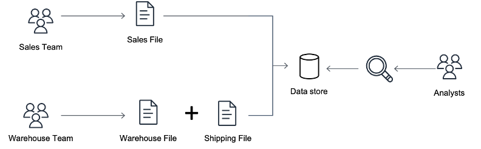
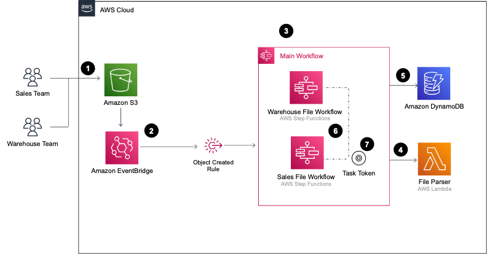

# Orchestrating dependent file uploads with Step Functions

This project is described in the AWS blog post here: < link to blog post >

## Getting Started

Prerequisites required:
1. AWS CLI
2. AWS SAM CLI
3. An AWS account
4. Sufficient permissions to manage the AWS resources
5. Git

From the main project directory:
1. `sam build`
2. `sam deploy --guided`

## Overview

This project creates an application in AWS which manages the dependency between two uploaded files to S3.



In this scenario, the Warehouse file needs to be processed before the Sales file. Each file can be uploaded in any order.

The uploaded files are stored in S3 and a Step Functions state machine is triggered upon upload. This state machine manages the dependency and processes the files.

## Architecture




## Cleanup

To delete the sample application that you created, use the AWS CLI. Assuming you used your project name for the stack name, you can run the following:

```bash
sam delete --stack-name multi-file-upload-eda
```

## Resources

See the [AWS SAM developer guide](https://docs.aws.amazon.com/serverless-application-model/latest/developerguide/what-is-sam.html) for an introduction to SAM specification, the SAM CLI, and serverless application concepts.

Next, you can use AWS Serverless Application Repository to deploy ready to use Apps that go beyond hello world samples and learn how authors developed their applications: [AWS Serverless Application Repository main page](https://aws.amazon.com/serverless/serverlessrepo/)

## Security

See [CONTRIBUTING](CONTRIBUTING.md#security-issue-notifications) for more information.

## License

This library is licensed under the MIT-0 License. See the LICENSE file.

